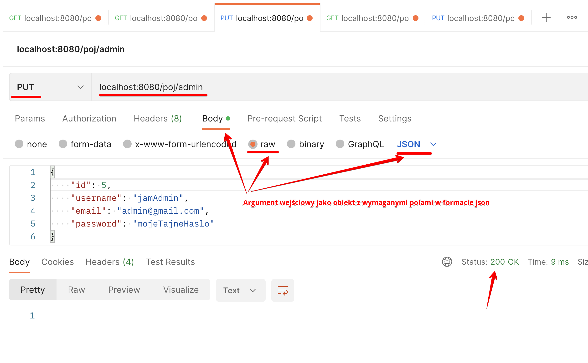
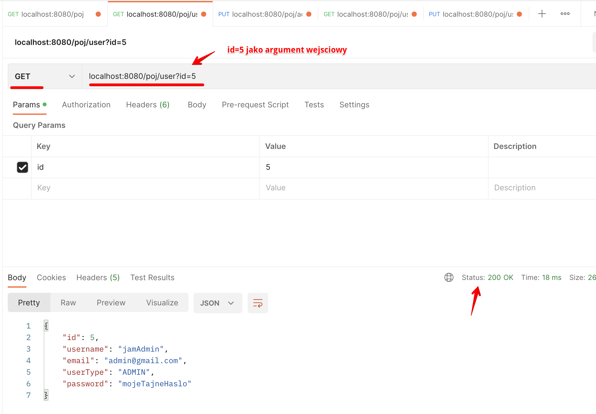

POJ 6
============

W czym pomaga nam obiektowość, paradygmaty programowania obiektowego oraz jak je stosujemy w developerce.

Prosty serwis napisany we frameworku Spring. W serwisie zastosowano wszystkie zasady oraz narzedzia programowania obiektowego w Javie:
 - tworzenie nowych obiektow ([UserDTO](src/main/java/com/poj/dtos/UserDTO.java), inicjalizacja serwisow)
 - tworzenie i wykorzystywanie enumow ([UserType](src/main/java/com/poj/dtos/UserType.java) oraz [UserDTO](src/main/java/com/poj/dtos/UserDTO.java)/[AdminDTO](src/main/java/com/poj/dtos/AdminDTO.java))
 - enkapsulacja (hermetyzacja) danych
 - dziedziczenie (relacja [UserDTO](src/main/java/com/poj/dtos/UserDTO.java) - [AdminDTO](src/main/java/com/poj/dtos/AdminDTO.java)) i wykorzystanie zalet dziedziczenia w kolekcjach ([UsersService](src/main/java/com/poj/services/UsersService.java))
 - modyfikatory dostępu ([UserDTO](src/main/java/com/poj/dtos/UserDTO.java) - [AdminDTO](src/main/java/com/poj/dtos/AdminDTO.java) i wszystkie atrybuty/metody, [UserDTO](src/main/java/com/poj/dtos/UserDTO.java) oraz protected userType)

## Przykłady weryfikacji działania aplikacji:
#### Używając narzędzia CURL z poziomu terminala:
```
curl localhost:8080/poj
```
Reponse:
```
Greetings from Spring Boot!
```

#### Używając aplikacji [Postman](https://www.postman.com/):
Przykładowy put:

Przykładowy get:


Oraz output z konsoli:
```
Zapisuje usera: UserDTO{id=5, username='jamAdmin', email='admin@gmail.com', type='Admin'}password: mojeTajneHaslo
Zwracam usera: UserDTO{id=5, username='jamAdmin', email='admin@gmail.com', type='Admin'}password: mojeTajneHaslo
```

## Źródła:
1. Generacja projektu podstawowego: [Spring initializr](https://start.spring.io/)
2. Aplikacja do wysyłania zapytań: [Postman](https://www.postman.com/)
3. Randomowy wpis z kilkoma przydatnymi skrótami klawiszowymi InteliJ: [skróty InteliJ](https://www.dailycodebuffer.com/27-intellij-shortcuts/) (hint: jest ich dużo więcej!)